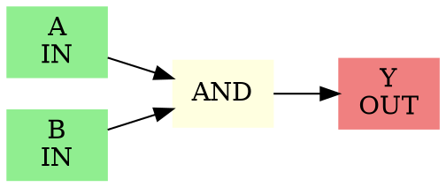

# Digital Circuit Simulator

[](https://en.cppreference.com/)
[](https://opensource.org/licenses/MIT)
[](https://github.com/piyush/circuit-simulator)

A comprehensive C++ program for simulating and visualizing digital logic circuits. This simulator allows users to define custom digital circuits using various logic gates, simulate their behavior with different input combinations, and generate visual circuit diagrams.


## 🌟 Features

- **Interactive Circuit Design**: Define circuits using an intuitive command-line interface
- **Multiple Gate Types**: Support for all common logic gates:
  - AND, OR, NOT
  - NAND, NOR
  - XOR, XNOR
- **Circuit Visualization**: Automatic generation of circuit diagrams using Graphviz
- **Comprehensive Simulation**: Test circuits with custom input combinations
- **Error Handling**: Robust input validation and error reporting
- **Cross-Platform**: Works on Windows, Linux, and macOS
- **Export Capabilities**: Generate DOT files and PNG circuit diagrams

## 🛠️ Requirements

### System Requirements
- **C++ Compiler**: GCC 7+ or equivalent with C++17 support
- **Operating System**: Windows 10+, Linux, or macOS
- **Memory**: Minimal (< 10 MB)

### Optional Dependencies
- **Graphviz**: For automatic circuit diagram generation
  - Windows: Download from [graphviz.org](https://graphviz.org/download/)
  - Linux: `sudo apt install graphviz` (Ubuntu/Debian) or `sudo yum install graphviz` (RHEL/CentOS)
  - macOS: `brew install graphviz`

## 🚀 Installation

### Quick Start (Windows)

1. **Clone or download the repository**:
   ```bash
   git clone https://github.com/your-username/circuit-simulator.git
   cd circuit-simulator
   ```

2. **Install MinGW-w64 (if not already installed)**:
   ```powershell
   winget install BrechtSanders.WinLibs.MCF.UCRT
   ```

3. **Compile the program**:
   ```bash
   g++ -o circuit.exe circuit.cpp -std=c++17 -static-libgcc -static-libstdc++
   ```

4. **Run the simulator**:
   ```bash
   ./circuit.exe
   ```

### Linux/macOS

1. **Ensure GCC is installed**:
   ```bash
   # Ubuntu/Debian
   sudo apt update && sudo apt install build-essential
   
   # RHEL/CentOS/Fedora
   sudo yum groupinstall "Development Tools"
   
   # macOS (using Homebrew)
   brew install gcc
   ```

2. **Compile and run**:
   ```bash
   g++ -o circuit circuit.cpp -std=c++17
   ./circuit
   ```

## 📋 Usage

### Basic Example

1. **Start the simulator**:
   ```
   ./circuit.exe
   ```

2. **Define your circuit**:
   ```
   Enter circuit name: HalfAdder
   Enter number of primary inputs: 2
   Enter names of primary inputs:
     Input 1: A
     Input 2: B
   Enter number of primary outputs: 2
   Enter names of primary outputs:
     Output 1: Sum
     Output 2: Carry
   ```

3. **Add logic gates**:
   ```
   Gate 1: XOR Sum A B
   Gate 2: AND Carry A B
   Gate 3: END
   ```

4. **Simulate the circuit**:
   ```
   Enter values for primary inputs (space-separated):
   Format: A B
   Input (or 'EXIT' to quit): 1 1
   
   SIMULATION RESULTS
   ----------------------------------------
   Inputs:
     A = 1
     B = 1
   
   Outputs:
     Sum = 0
     Carry = 1
   ```

### Supported Gate Types

| Gate | Description | Inputs | Example Usage |
|------|-------------|--------|---------------|
| `AND` | Logical AND | 2 | `AND Z A B` |
| `OR` | Logical OR | 2 | `OR Y A B` |
| `NOT` | Logical NOT | 1 | `NOT X A` |
| `NAND` | NOT AND | 2 | `NAND W A B` |
| `NOR` | NOT OR | 2 | `NOR V A B` |
| `XOR` | Exclusive OR | 2 | `XOR U A B` |
| `XNOR` | NOT XOR | 2 | `XNOR T A B` |

### Circuit Examples

#### Full Adder
```
Circuit Name: FullAdder
Primary Inputs: A, B, Cin
Primary Outputs: Sum, Cout

Gates:
XOR temp1 A B
XOR Sum temp1 Cin
AND temp2 A B
AND temp3 temp1 Cin
OR Cout temp2 temp3
END
```

#### 2-to-1 Multiplexer
```
Circuit Name: Mux2to1
Primary Inputs: A, B, Select
Primary Outputs: Y

Gates:
NOT NotSelect Select
AND temp1 A NotSelect
AND temp2 B Select
OR Y temp1 temp2
END
```

## 📊 Output Files

The simulator generates several output files:

1. **`CircuitName.dot`**: Graphviz DOT file for circuit visualization
2. **`CircuitName.png`**: Circuit diagram (if Graphviz is installed)

### Sample DOT File Structure


## 🏗️ Code Structure

### Main Components

- **`Gate` struct**: Represents a logic gate with type, output, and inputs
- **`evalGate()`**: Evaluates gate logic based on input values
- **`simulate()`**: Propagates values through the entire circuit
- **`writeDot()`**: Generates Graphviz visualization files
- **Input validation functions**: Ensure robust error handling

### Architecture
```
circuit.cpp
├── Headers & Includes
├── Data Structures
│   ├── Gate struct
│   ├── Global variables (values, gates, inputs, outputs)
├── Core Functions
│   ├── evalGate() - Logic evaluation
│   ├── simulate() - Circuit simulation
│   ├── writeDot() - Visualization
├── Utility Functions
│   ├── toUpper() - String conversion
│   ├── isValidGateType() - Validation
│   ├── getRequiredInputs() - Input counting
└── Main Program Flow
    ├── User input collection
    ├── Circuit definition
    ├── Visualization generation
    └── Simulation loop
```

## 🧪 Testing

### Test Cases

1. **Basic Gates Test**:
   ```bash
   # Test all gate types with truth table verification
   ./circuit.exe < test_basic_gates.txt
   ```

2. **Complex Circuit Test**:
   ```bash
   # Test multi-gate circuits like adders, multiplexers
   ./circuit.exe < test_complex_circuits.txt
   ```

### Sample Test Input
```
TestCircuit
2
A
B
1
Y
AND Y A B
END
0 0
0 1
1 0
1 1
EXIT
```

## 🤝 Contributing

Contributions are welcome! Here's how you can help:

1. **Fork the repository**
2. **Create a feature branch**: `git checkout -b feature/new-feature`
3. **Make your changes**
4. **Add tests** for new functionality
5. **Commit your changes**: `git commit -am 'Add new feature'`
6. **Push to the branch**: `git push origin feature/new-feature`
7. **Create a Pull Request**

### Code Style Guidelines
- Use meaningful variable names
- Add comments for complex logic
- Follow existing indentation (4 spaces)
- Include Doxygen-style documentation for functions

## 📝 Documentation

### Function Documentation

All functions are documented using Doxygen format:

```cpp
/**
 * @brief Evaluates a logic gate based on its type and input values
 * @param g The gate to evaluate
 * @return The output value (0 or 1) of the gate
 */
int evalGate(const Gate &g);
```

### Generate Documentation
```bash
# If you have Doxygen installed
doxygen Doxyfile
```

## 🐛 Troubleshooting

### Common Issues

1. **Compilation Errors**:
   - Ensure C++17 support: Use `-std=c++17` flag
   - Check compiler version: `g++ --version`

2. **Graphviz Not Found**:
   - Install Graphviz from [official website](https://graphviz.org/)
   - Ensure `dot` command is in PATH

3. **Input Parsing Issues**:
   - Use exact format: `GATETYPE OUTPUT INPUT1 [INPUT2]`
   - Gate types are case-insensitive
   - Separate inputs with spaces

4. **Runtime Errors**:
   - Ensure proper gate dependencies (outputs before inputs)
   - Check for circular dependencies
   - Validate input/output names

### Getting Help

- **Issues**: Report bugs on GitHub Issues
- **Discussions**: Use GitHub Discussions for questions
- **Email**: Contact the author for urgent issues

## 📄 License

This project is licensed under the MIT License - see the [LICENSE](LICENSE) file for details.

```
MIT License

Copyright (c) 2025 Piyush

Permission is hereby granted, free of charge, to any person obtaining a copy
of this software and associated documentation files (the "Software"), to deal
in the Software without restriction, including without limitation the rights
to use, copy, modify, merge, publish, distribute, sublicense, and/or sell
copies of the Software, and to permit persons to whom the Software is
furnished to do so, subject to the following conditions:

The above copyright notice and this permission notice shall be included in all
copies or substantial portions of the Software.

THE SOFTWARE IS PROVIDED "AS IS", WITHOUT WARRANTY OF ANY KIND, EXPRESS OR
IMPLIED, INCLUDING BUT NOT LIMITED TO THE WARRANTIES OF MERCHANTABILITY,
FITNESS FOR A PARTICULAR PURPOSE AND NONINFRINGEMENT. IN NO EVENT SHALL THE
AUTHORS OR COPYRIGHT HOLDERS BE LIABLE FOR ANY CLAIM, DAMAGES OR OTHER
LIABILITY, WHETHER IN AN ACTION OF CONTRACT, TORT OR OTHERWISE, ARISING FROM,
OUT OF OR IN CONNECTION WITH THE SOFTWARE OR THE USE OR OTHER DEALINGS IN THE
SOFTWARE.
```

## 🏆 Acknowledgments

- **Graphviz**: For excellent graph visualization capabilities
- **MinGW-w64**: For providing GCC compiler for Windows
- **C++ Community**: For continuous language improvements and standards

## 📈 Version History

### v1.0 (Current)
- ✅ Initial release
- ✅ Support for 7 gate types (AND, OR, NOT, NAND, NOR, XOR, XNOR)
- ✅ Interactive circuit definition
- ✅ Circuit simulation with custom inputs
- ✅ Graphviz visualization generation
- ✅ Comprehensive error handling
- ✅ Cross-platform compatibility

### Future Releases
- 🔄 **v1.1**: Sequential circuit support (flip-flops, latches)
- 🔄 **v1.2**: GUI interface using Qt or similar
- 🔄 **v1.3**: VHDL/Verilog import/export
- 🔄 **v1.4**: Timing analysis and delay simulation

---

**Made with ❤️ by Piyush | Digital Circuit Simulator v1.0**